# System architecture

## Architecture summary

The MVP is a client-only progressive web app deployed as static assets. React and PDF.js handle interaction and rendering; domain services own capture, retrieval, and connection behavior; Dexie repositories persist user data in IndexedDB; a Workbox service worker caches only the application shell and static assets.

```mermaid
flowchart LR
    subgraph Presentation["Presentation"]
        UI["React UI<br/>Reader, Points, Connected"]
        PDF["PDF.js workspace<br/>Canvas, text layer, coordinates"]
        PWA["PWA shell<br/>Installable and offline"]
    end
    subgraph Domain["Domain and application"]
        Services["Domain services<br/>Points, connections, navigation"]
        Retrieval["Search and suggestions<br/>Local field search and similarity"]
        Repos["Repository layer<br/>Transactions and migrations"]
    end
    subgraph Device["On-device storage"]
        IDB["IndexedDB<br/>PDF, metadata, points, anchors, links"]
        Cache["Service worker cache<br/>App shell and static assets"]
    end
    Presentation --> Domain --> Device
```

No application backend is required. Paper content remains on the device.

## Technology baseline

| Layer | Choice | Rationale |
| --- | --- | --- |
| UI | React 19, TypeScript, responsive CSS | Component model, mature ecosystem, mobile support |
| Build | Vite | Static build and straightforward PDF worker configuration |
| PDF | PDF.js | Browser rendering, text layer, page viewports, coordinate conversion |
| Persistence | IndexedDB via Dexie | Blob storage, transactions, indexes, migrations |
| State | Zustand plus repository hooks | Small session state without coupling durable data to components |
| Search | MiniSearch | Local weighted field search and prefix matching |
| Suggestions | Local TF-IDF/cosine scorer | Transparent similarity without a model or network request |
| Offline | Workbox service worker | Precaching and controlled update behavior |
| Testing | Vitest, Testing Library, Playwright | Unit, component, integration, mobile, and end-to-end coverage |

## Component boundaries

- **PDF workspace:** loading, page virtualization, zoom, rotation, text layer, region mode, and overlays.
- **Point editor:** title, note, source preview, validation, save, and delete confirmation.
- **Connection picker:** suggestions, full search, relationship choice, and duplicate handling.
- **Connected outline:** focal point, direction-aware labels, ordering, expansion, and jump actions.
- **Domain services:** anchor capture, coordinate transforms, CRUD, search indexing, and similarity ranking.
- **Repository layer:** Dexie tables, migrations, transactions, storage estimates, and persistence requests.

UI components do not write IndexedDB directly. They invoke domain operations backed by repository interfaces. PDF.js-specific viewport objects stay inside the PDF workspace and anchoring adapter; persisted domain records contain serializable PDF coordinates only.

## State ownership

| State | Owner | Examples |
| --- | --- | --- |
| Durable | Dexie repositories | PDF, points, anchors, connections, last reading position |
| Session | Zustand | Active point, active view, selection mode, pending jump |
| Derived | Selectors/services | Connected bullets, inverse labels, suggestion rankings |
| Render | PDF workspace | Visible pages, canvas readiness, viewport transforms |

Durable state is never reconstructed solely from UI state. Derived state is reproducible from durable records.

## Offline lifecycle

1. The service worker precaches the shell, icons, PDF.js worker, and static assets.
2. Imported PDF bytes and annotations remain in IndexedDB, never in the service-worker cache.
3. After import, the app requests `navigator.storage.persist()` and displays storage status without blocking use if denied.
4. Reading position is autosaved with a short debounce; explicit point saves flush immediately.
5. App updates enter a waiting state with a visible **Reload to update** action. The app never reloads while an unsaved editor is open.

Local browser data can still be cleared by the user or operating system. Until portable export exists, Settings must expose persistent-storage status and a storage-health indicator.

## Security and privacy

- Treat PDF metadata and extracted text as untrusted text; never inject them as HTML.
- Validate the file signature and MIME type before import.
- Use Blob URLs only for the active PDF and revoke them when it closes.
- Apply a restrictive Content Security Policy allowing the PDF.js worker and local blobs but no arbitrary remote scripts.
- Do not send analytics containing filenames, titles, notes, excerpts, metadata, or page content.
- Cap resource-intensive operations to avoid accidental browser exhaustion.
- Store no secrets. Any future upload or backend is a separate product and architecture decision.

## Architectural seams for later work

Repository interfaces, the search index adapter, and the similarity scorer should remain replaceable. This supports future export/import or alternative retrieval without changing UI contracts, but does not pre-build cloud synchronization, multi-paper support, or embeddings.
