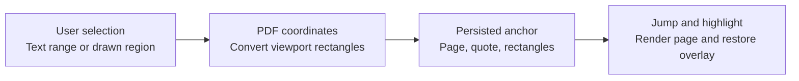

# PDF source anchoring

## Principle

The durable source identifier is a page plus rectangles in PDF page coordinates, not browser pixels. PDF coordinates survive zoom, screen-size changes, and page virtualization. Text anchors also retain quote context for verification and possible future re-anchoring.

## Text selection capture

1. Read the browser `Selection`; reject collapsed or cross-document ranges.
2. Collect client rectangles from the PDF.js text-layer `Range` and group them by page.
3. Require one-page selections in the MVP. Explain cross-page rejection rather than silently truncating.
4. Convert rectangle corners with `PDFPageViewport.convertToPdfPoint`, normalize orientation, and store ordered PDF rectangles.
5. Normalize whitespace in `Selection.toString()` and retain the exact text plus up to 64 characters of prefix and suffix from extracted page text.
6. Default `sourceSummary` to `Page N — Text` unless the user enters a more specific description.

### Normalization rules

- Preserve reading order from the text layer.
- Collapse runs of whitespace to one space and trim ends.
- Do not lowercase or otherwise alter the saved exact quote.
- Normalize each rectangle so `x1 ≤ x2` and `y1 ≤ y2`.
- Reject empty rectangles and rectangles outside the page bounds after allowing a small floating-point tolerance.

## Region capture

1. The reader explicitly enables region mode.
2. A drag overlay is constrained to one rendered page.
3. Both corners are converted from viewport to PDF coordinates and normalized.
4. The app crops a small WebP preview from the page canvas for list display.
5. The PDF rectangle—not the preview—is the source of truth.
6. Default `sourceSummary` to `Page N — Selected region`. Figure, scheme, and table labels are user-entered, never inferred.

## Jump and restoration

1. Set the active reader page and ask virtualization to materialize it.
2. Wait until the page canvas and overlay layer report ready.
3. Convert the stored PDF rectangles to the current viewport.
4. Scroll the anchor's top edge into the center third of the screen.
5. Draw the saved highlight or region and run a short pulse that honors reduced-motion preferences.

Coordinate conversion is tested across zoom levels, rotation, device-pixel ratios, and desktop/mobile widths. Rendering must not overwrite the stored anchor with viewport coordinates.

## Failure behavior

If exact restoration fails, the app still navigates to the saved page and shows a non-blocking message: **Source location could not be restored.** It presents the saved excerpt and page number so the record remains useful. Failure does not mutate or discard the anchor.

Likely causes should be logged locally without page content: missing page, render failure, invalid rectangle, or quote verification mismatch.

## Future re-anchoring boundary

The MVP does not silently move anchors. A future compatible-paper import may use `exact`, `prefix`, and `suffix` to propose a new location, but must preserve the original anchor until the user accepts the change.
